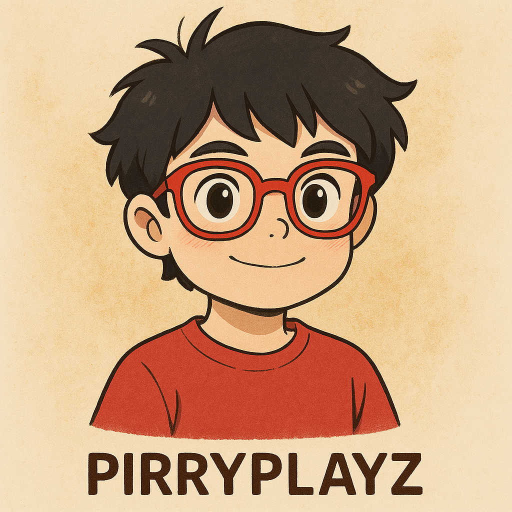

<table>
  <tr>
    <td width="60%" align="center">
  
 </td>

 <td width="40%" align="center">
  
  

🚀 Developer | 🎮 Gamer | 🧠 Problem Solver

---

## 🧠 About Me
- 🎯 Passionate full-stack developer and game enthusiast.
- 💻 Currently working on projects using **JavaScript, Python, C++, C#, and Node.js**.
- 🌱 Learning new tech every day — recently exploring **Web3, AI/ML, and Backend Systems**.
- 🔍 I enjoy solving real-world problems through code and design.

---

## 🧰 Tech Stack

| Frontend        | Backend         | Tools & DevOps         | Languages       |
|-----------------|------------------|-------------------------|-----------------|
| HTML, CSS, JS, React, Tailwind | Node.js, Express, Firebase | Git, GitHub, VSC, Docker | Python, C++, C#, JavaScript |

---

## 💼 Projects

### 🎮 Valorant 2D Map Game (C++ Only)
- 🔧 Engineered a 2D replica of Valorant’s map using **pure C++**.
- 🎮 Built custom movement logic and collision detection.

### 🛠️ Spotify Clone
- 📀 Developed a music streaming UI with **HTML/CSS/JavaScript**.
- 🎵 Linked mock data to simulate music browsing.

### 🌐 Discord Clone (.NET & C#)
- 🧱 Built with **ASP.NET** to simulate real-time messaging.
- 🔒 Integrated login + role-based channel access.

### 🔗 Web3 Skill Portfolio
- 🪙 Created a Web3-integrated portfolio with **React + MetaMask login**.
- 🌐 Showcased NFT achievements and blockchain projects.

---

## 📈 GitHub Stats

  
   
  

---

## 📬 Connect with Me

  
  
  

---

> *“Code what you dream. Build what you believe.”*
